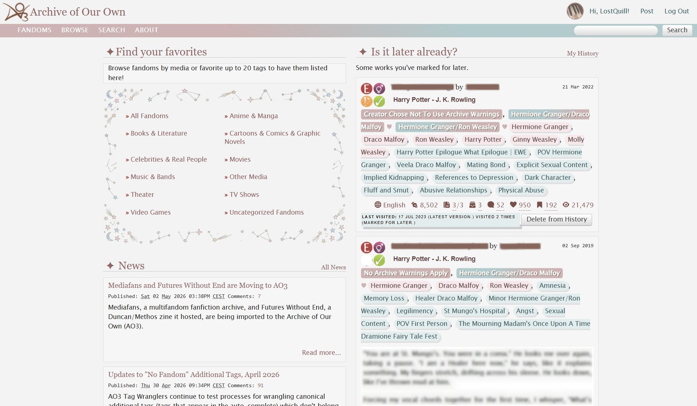
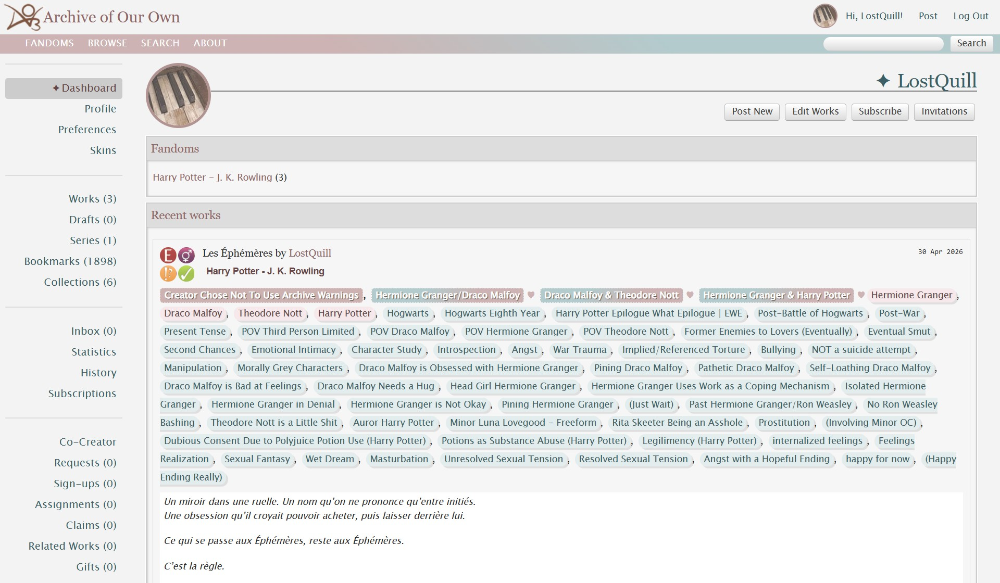
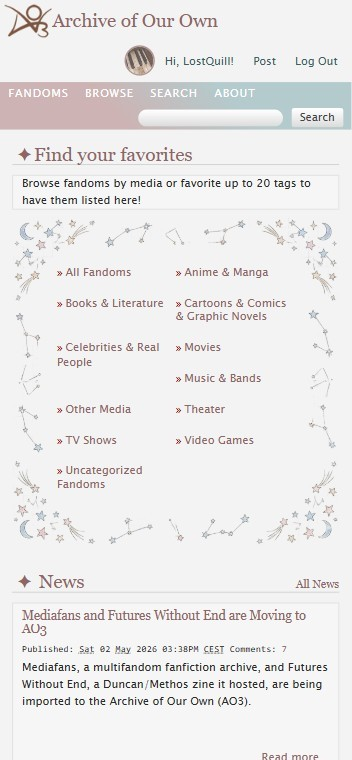
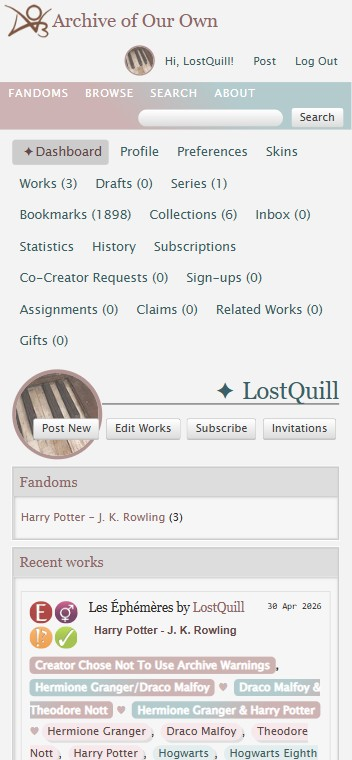

# Pale Reverie — AO3 Site Skin

A soft, muted site skin for AO3 with a dark academia edge.

**Pale Reverie** layers a dusty rose and cool slate palette over the default AO3 layout, with color-coded tags, icon-based statistics with hover tooltips, and a constellation border framing work metadata. The overall aesthetic is desaturated and quiet — like reading by candlelight.

A dark mode version may come in the future.

## Features

- Color-coded tags by type (warnings, relationships, characters, freeforms)
- Icon-based stats display with hover text labels
- Constellation border around work metadata
- Gradient header in muted rose and slate tones
- Responsive layout for tablet and mobile
- All colors defined as CSS variables for easy customization

## Preview

### Desktop

### Mobile

## Installation

See the [AO3 work](#) for full installation instructions.

## Files

| File | Description |
|------|-------------|
| `main.css` | Base styles — colors, tags, layout, stats icons |
| `responsive.css` | Responsive overrides for tablet and mobile |

## Credits

- Stats icons & hover text system by [ZerafinaCSS](https://archiveofourown.org/works/55604875)
  - AO3: [Stats Icons with Hover Text](https://archiveofourown.org/works/55604875)
  - GitHub: [ZerafinaCSS/AO3-Stats-Icons-with-Hover-Text](https://github.com/ZerafinaCSS/AO3-Stats-Icons-with-Hover-Text)
- Constellation border image, kudos illustration, and CSS placeholder icon generated with Google Gemini

## License

You are welcome to use, edit, or build upon this CSS however you like. Please credit me by linking to the [AO3 work](#) or this repository.
